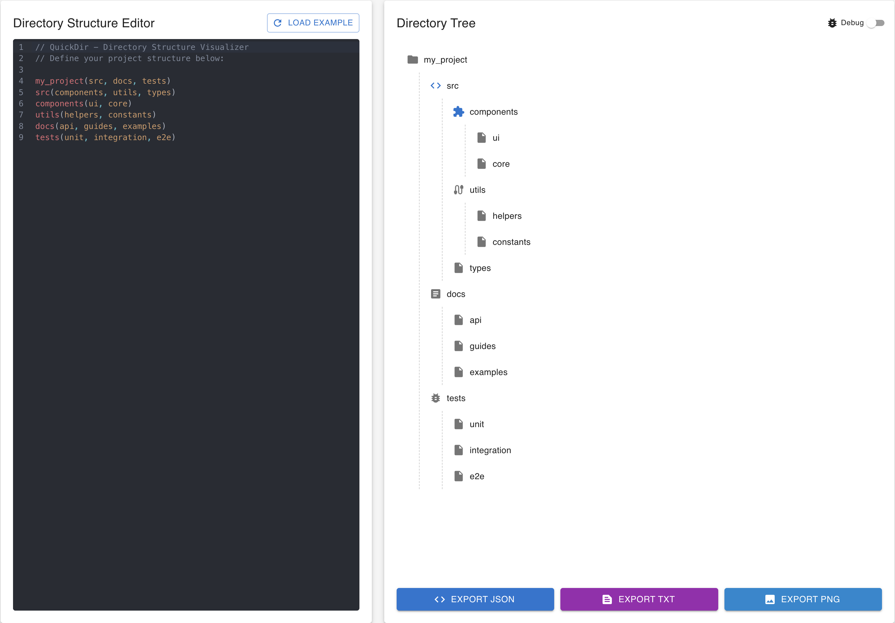

# QuickDir

A visual directory structure generator and visualizer that helps you plan and document your project's folder structure.



## Features

- Easy-to-use directory structure editor with syntax highlighting
- Visual directory tree representation with custom icons
- Export your structure as JSON or TXT
- Debug mode for visualization of parsed structures
- Support for both modern tree view and simple list view

## Technologies

- React 19
- TypeScript 5
- Material UI 7
- CodeMirror for code editing
- Vite for development and building

## Getting Started

### Prerequisites

- Node.js 18+ and npm

### Installation

1. Clone the repository:

```bash
git clone https://github.com/yourusername/QuickDir.git
cd QuickDir
```

2. Install dependencies:

```bash
npm install
```

### Development

Start the development server:

```bash
npm run dev
```

This will start the application at `http://localhost:5173`.

### Building for Production

Build the application:

```bash
npm run build
```

Preview the production build:

```bash
npm run preview
```

## Usage

1. Define your directory structure in the editor using the syntax:
   - `variable = name` to define a node with a specific name
   - `parent = child(child1 child2)` to define parent-child relationships

2. Example structure:
```
level0 = MyProject
level0 = child(src docs tests)

src = child(components utils types)
components = child(Button Header)
utils = child(helpers constants)
```

3. Export your structure as JSON or TXT using the buttons at the bottom of the tree view.

## Project Structure

```
QuickDir/
├── public/          # Static assets
├── src/
│   ├── components/  # React components
│   ├── types/       # TypeScript type definitions
│   └── utils/       # Utility functions and helpers
└── ...              # Configuration files
```

## License

This project is licensed under the MIT License - see the LICENSE file for details.
